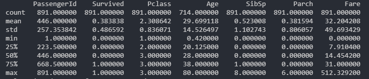
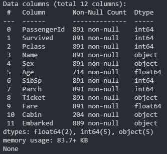
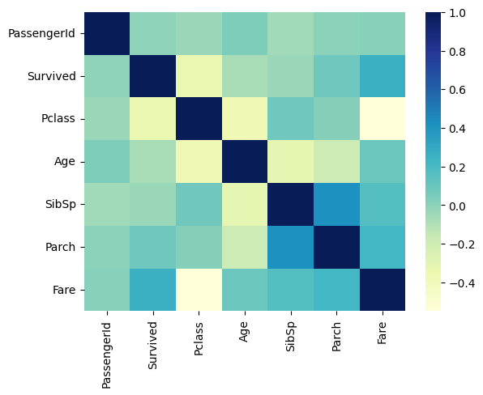

# CODSOFT
Data Science Internship
# Project 1 : Titanic Survival Prediction
# Objectives: 
1-Use the Titanic dataset to build a model that predicts whether a
passenger on the Titanic survived or not. This is a classic beginner
project with readily available data.

2-The dataset typically used for this project contains information
about individual passengers, such as their age, gender, ticket
class, fare, cabin, and whether or not they survived.

# Data Preprocessing
## Import libraries
```python
import pandas as pd
import numpy as np
import matplotlib.pyplot as plt
```
## Load the Dataset
```python
titanic_dataset = pd.read_csv('/content/Titanic-Dataset.csv')
```
## Get some Info and description about the dataset
```python
print(titanic_dataset.describe())
print(titanic_dataset.info())
print(titanic_dataset.head())
print(titanic_dataset.tail())
```



- From the given data we can see that there exists some columns that do not contribute to the survival:
- - "PassengerId"
  - "Name"
  - "Ticket"
  - "Cabin"
- There are also some missing data in the "Age" and "Embarked" columns
  
## Plot a Heatmap: Understand the features and identify the relation between features and survival
```python
numeric_columns = titanic_dataset.select_dtypes(include=["int64", "float64"])
import seaborn as sns
sns.heatmap(numeric_columns.corr(), cmap = "YlGnBu")
plt.show()
```


## Check if Dataset is imbalanced
```python
survived_counts = titanic_dataset['Survived'].value_counts()

# Plot the histogram
plt.figure(figsize=(8, 6))
plt.bar(survived_counts.index, survived_counts.values, color=['red', 'green'])
plt.title('Survival Histogram')
plt.xlabel('Survived')
plt.ylabel('Count')
plt.xticks(survived_counts.index, ['Not Survived', 'Survived'])
plt.grid(axis='y', linestyle='--', alpha=0.7)
plt.show()
```


