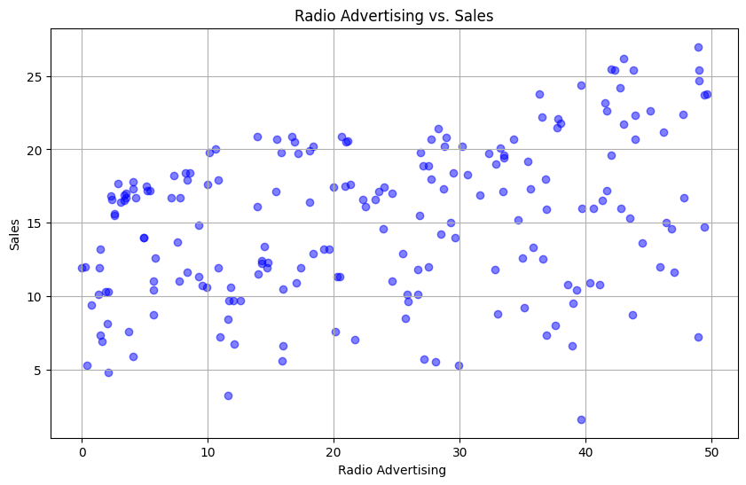

# CODSOFT
Data Science Internship
# Project 2 : Sales Prediction Using Python
# Objectives:
1- Sales prediction involves forecasting the amount of a product that customers will purchase, taking into account various factors such as advertising expenditure, target audience segmentation, and advertising platform selection

2- In businesses that offer products or services, the role of a Data Scientist is crucial for predicting future sales. They utilize machine learning techniques in Python to analyze and interpret data, allowing them to make informed decisions regarding advertising costs. By leveraging these predictions, businesses can optimize their advertising strategies and maximize sales potential. Let's embark on
the journey of sales prediction using machine learning in Python.

# Data Preprocessing
## Import libraries
```python
import numpy as np
import pandas as pd
import matplotlib.pyplot as plt
```
## Load the Dataset
```python
Sales_dataset = pd.read_csv('/content/advertising.csv')
```
## Get some info and description about the Dataset
```python
Sales_dataset.head()
```


```python
Sales_dataset.describe()
```


```python
Sales_dataset.info()
```

- From the given observation we can deduce that there is no missing data to handle.
- Moreover there is no need for the categorical data to be encoded
# Plot a Heatmap: Understand the features and identify the relation between features and Sales
```python
import seaborn as sns
sns.heatmap(Sales_dataset.corr(), cmap = 'YlGnBu')
```

- From the Correlation Heatmap, we can deduce that 'TV' advertisement resulted in the most sales.
# Scatter plot for TV ads vs Sales
```python
plt.figure(figsize=(10, 6))  # Adjust size as needed
plt.scatter(Sales_dataset['TV'], Sales_dataset['Sales'], color='blue', alpha=0.5) 
plt.title('TV Advertising vs. Sales')
plt.xlabel('TV Advertising ')
plt.ylabel('Sales')
plt.grid(True)
plt.show()
```


# Scatter plot for Radio ads vs Sales
```python
plt.figure(figsize=(10, 6))  # Adjust size as needed
plt.scatter(Sales_dataset['Radio'], Sales_dataset['Sales'], color='blue', alpha=0.5) 
plt.title('Radio Advertising vs. Sales')
plt.xlabel('Radio Advertising ')
plt.ylabel('Sales')
plt.grid(True)
plt.show()
```

# Scatter plot for Newspaper ads vs Sales
```python
plt.figure(figsize=(10, 6))  # Adjust size as needed
plt.scatter(Sales_dataset['Newspaper'], Sales_dataset['Sales'], color='blue', alpha=0.5) 
plt.title('Newspaper Advertising vs. Sales')
plt.xlabel('Newspaper Advertising ')
plt.ylabel('Sales')
plt.grid(True)
plt.show()
```


# Plot of the Total Sales with respect to each Media channel
```python
media_channels = ['TV', 'Radio', 'Newspaper']
total_sales = [Sales_dataset['TV'].sum(), Sales_dataset['Radio'].sum(), Sales_dataset['Newspaper'].sum()]

plt.bar(media_channels, total_sales, color='skyblue')
plt.xlabel('Media Channel')
plt.ylabel('Total Sales')
plt.title('Total Sales by Media Channel')
plt.show()
```

- Looking at the Plots, we can directly see that a Multiple Linear regression model can do the trick and help us predict future sales.
# Preprocessing the Dataset
## Creating matrix of features and the dependent variable
```python
X = Sales_dataset.iloc[:, :-1].values
y = Sales_dataset.iloc[:, -1]
```
## Splitting the dataset into train and test
```python
from sklearn.model_selection import train_test_split
X_train, X_test, y_train, y_test = train_test_split(X, y, test_size= 0.3, random_state = 1)
print('x_train: ', X_train)
print('x_test: ', X_test)
print('y_train: ', y_train)
print('y_test: ', y_test)
```
## Feature Scaling: Standardization
```python
from sklearn.preprocessing import StandardScaler
sc = StandardScaler()
X_train = sc.fit_transform(X_train)
X_test = sc.transform(X_test)
print('Featured Scaled x-train:\n ',X_train)
print('Featured Scaled x-test:\n ',X_test)
```
- This step is beneficial in order to equal weighting and enhance the model performance
# Machine Learning
## Multiple Linear regression
```python
from sklearn.linear_model import LinearRegression
regressor = LinearRegression()
regressor.fit(X_train, y_train)
```
## Predict on the test set
```python
y_pred = regressor.predict(X_test)
```
## Assess The Model
```python
from sklearn.metrics import r2_score, mean_squared_error
# Calculate R-squared
r2 = r2_score(y_test, y_pred)
# Calculate RMSE
rmse = np.sqrt(mean_squared_error(y_test, y_pred))

print("R-squared:", r2)
print("RMSE:", rmse)
```
### Result:
- R-squared: 0.9071151423684273
- RMSE: 1.5396947656031235
## Find the Regressor's Coefficients
```python
print('regressor coefficient: ', regressor.coef_)
print('regressor intercept: ',regressor.intercept_)
```
- regressor coefficient:  [ 4.76446306  1.55877627 -0.03241007]
- regressor intercept:  14.847857142857148
## Plot the Linear Regression Model for TV
```python
# Generate predicted values using the trained model
predicted_values = regressor.coef_[0] * X_train[:, 0] + regressor.intercept_

# Plot the training dataset and the trained model
plt.figure(figsize=(8, 6))
plt.scatter(X_train[:, 0], y_train, color='blue', label='Training Data')
plt.plot(X_train[:, 0], predicted_values, color='red', label='Trained Model')
plt.title('Trained Model and Training Dataset')
plt.xlabel('Independent Variable 1')
plt.ylabel('Target Variable')
plt.legend()
plt.grid(True)
plt.show()
```

## Plot the Linear Regression Model for Radio
```python
# Generate predicted values using the trained model
predicted_values = regressor.coef_[1] * X_train[:, 1] + regressor.intercept_

# Plot the training dataset and the trained model
plt.figure(figsize=(8, 6))
plt.scatter(X_train[:, 1], y_train, color='blue', label='Training Data')
plt.plot(X_train[:, 1], predicted_values, color='red', label='Trained Model')
plt.title('Trained Model and Training Dataset')
plt.xlabel('Independent Variable 2')
plt.ylabel('Target Variable')
plt.legend()
plt.grid(True)
plt.show()
```

## Plot the Linear regression Model for Newspaper
```python
# Generate predicted values using the trained model
predicted_values = regressor.coef_[2] * X_train[:, 2] + regressor.intercept_

# Plot the training dataset and the trained model
plt.figure(figsize=(8, 6))
plt.scatter(X_train[:, 2], y_train, color='blue', label='Training Data')
plt.plot(X_train[:, 2], predicted_values, color='red', label='Trained Model')
plt.title('Trained Model and Training Dataset')
plt.xlabel('Independent Variable 3')
plt.ylabel('Target Variable')
plt.legend()
plt.grid(True)
plt.show()
```


## Predict a future value:
```python
# predicting Sales
# Reshape the input data into a 2D array
input_data = np.array([230.1, 37.8, 69.2]).reshape(1, -1)

input_data_scaled = sc.transform(input_data)

# Make predictions using the reshaped data
predicted_value = regressor.predict(input_data_scaled)

# Print the predicted value
print(predicted_value)
```
### Result:
- [21.09303051]
## Find the absolute percentage error for the model:
```python
from sklearn.metrics import mean_absolute_percentage_error
mape = mean_absolute_percentage_error(y_test, y_pred) * 100
print(f'Mean Absolute Percentage Error (MAPE): {mape:.2f}%')
```
- Mean Absolute Percentage Error (MAPE): 7.70%
