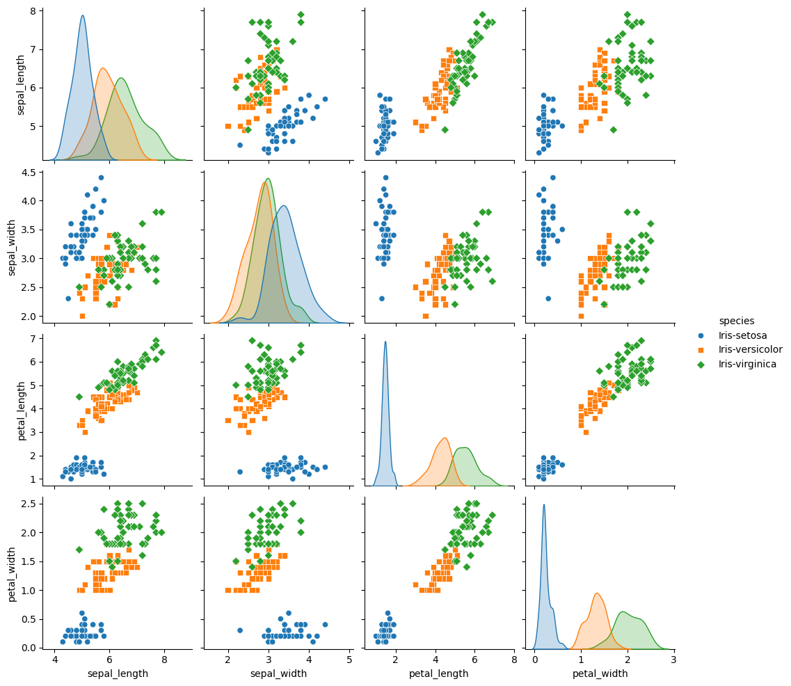
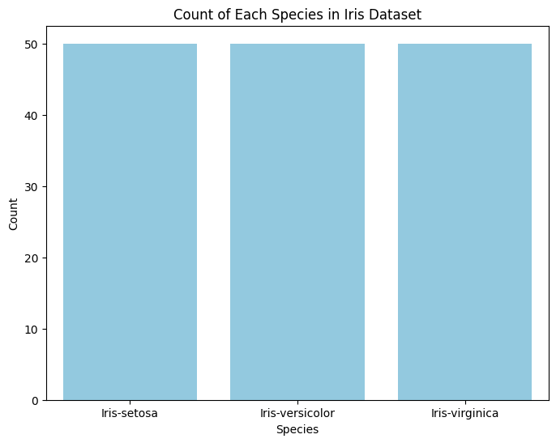
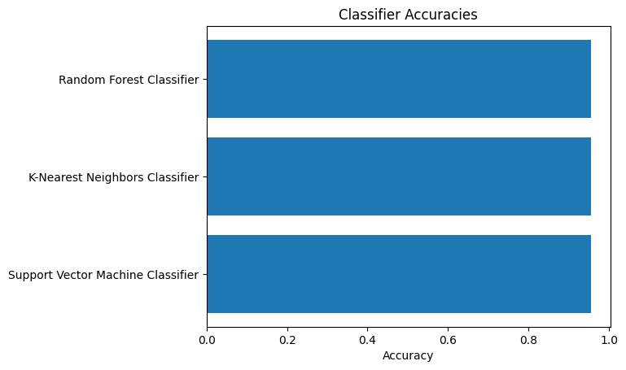
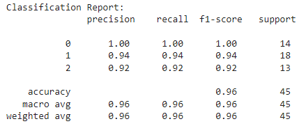

# CODSOFT
Data Science Internship
# Project 3: IRIS Flower Classification
# Objectives:
1- The Iris flower dataset consists of three species: setosa, versicolor, and virginica. These species can be distinguished based on their measurements. Now, imagine that you have the measurements of Iris flowers categorized by their respective species. Your objective is to train a machine learning model that can learn from these measurements and accurately classify the Iris flowers into their respective species.

2- Use the Iris dataset to develop a model that can classify iris flowers into different species based on their sepal and petal measurements. This dataset is widely used for introductory classification tasks.
# Data Preprocessing
## Import Libraries
```python
import numpy as np
import pandas as pd
import matplotlib.pyplot as plt
```
## Load the Dataset
```python
IRIS_dataset = pd.read_csv('/content/IRIS.csv')
```
## Get some info and description about the Dataset
```python
IRIS_dataset.head()
```


```python
IRIS_dataset.describe()
```

```python
IRIS_dataset.info()
```


## Check for null values
```python
IRIS_dataset.isnull().sum()
```

- From these observations we can deduce that:
- - No missing values or null values.
  - We should Label encode the dependent variable 'species'.
  - Feature engineering: Standardization to improve the performance of the model
# Visualization
## Plotting a Pairplot 
```python
import seaborn as sns
sns.pairplot(IRIS_dataset, hue="species", markers=["o", "s", "D"])
plt.show()
```


- After doing some research I found out that instead of plotting every column alone, a pairplot can be useful in order to visualize the data in order to analyze the correlation and identify patterns and trends.

## Ploting the Species Count
```python
# Count the occurrences of each species
species_counts = IRIS_dataset['species'].value_counts()

# Plot the bar chart
plt.figure(figsize=(8, 6))
sns.barplot(x=species_counts.index, y=species_counts.values, color='skyblue')
plt.xlabel('Species')
plt.ylabel('Count')
plt.title('Count of Each Species in Iris Dataset')
plt.show()
```

# Preprocessing the Dataset
## Creating the matrix of features and the dependent variable
```python
X = IRIS_dataset.iloc[:, :-1].values
y = IRIS_dataset.iloc[:, -1].values
print('Matrix of Features: ', X )
print('Dependent Variable: ', y)
```
## Label Encoding the Dependent Variable
```python
from sklearn.preprocessing import LabelEncoder
le = LabelEncoder()
y = le.fit_transform(y)
print('Encoded Categorical dependent variable vector: ', y)
```
- 0 : Iris-setosa
- 1 : Iris-versicolor
- 2 : Iris-virginica
## Splitting the dataset into train and test
```python
from sklearn.model_selection import train_test_split
X_train, X_test, y_train, y_test = train_test_split(X, y, test_size= 0.3, random_state = 1)
print('x_train: ', X_train)
print('x_test: ', X_test)
print('y_train: ', y_train)
print('y_test: ', y_test)
```
## Feature Scaling: Standardization
```python
from sklearn.preprocessing import StandardScaler
sc = StandardScaler()
X_train = sc.fit_transform(X_train)
X_test = sc.transform(X_test)
print('Featured Scaled x-train:\n ',X_train)
print('Featured Scaled x-test:\n ',X_test)
```
# Machine Learning
## Choosing the best between 3 Classification Models (KNN, SVC and Random Forest Classifier)
### import libraries
```python
from sklearn.ensemble import RandomForestClassifier
from sklearn.neighbors import KNeighborsClassifier
from sklearn.svm import SVC
from sklearn.metrics import accuracy_score
```
### Define Classifiers
```python
classifiers = {
    "Random Forest Classifier": RandomForestClassifier(n_estimators=100, random_state=42),
    "K-Nearest Neighbors Classifier": KNeighborsClassifier(n_neighbors=5),
    "Support Vector Machine Classifier": SVC(kernel='rbf', random_state=42)
}

accuracies = []
```
### Loop through classifiers: Get the best Model with the best accuracy
```python
for name, classifier in classifiers.items():
    classifier.fit(X_train, y_train)
    y_pred = classifier.predict(X_test)
    accuracy = accuracy_score(y_test, y_pred)
    accuracies.append(accuracy)
    print(f"{name} Accuracy: {accuracy}")
```
- Random Forest Classifier Accuracy: 0.9555555555555556
- K-Nearest Neighbors Classifier Accuracy: 0.9555555555555556
- Support Vector Machine Classifier Accuracy: 0.9555555555555556
### Plotting the accuracies
```python
fig, ax = plt.subplots()
models = classifiers.keys()
y_pos = np.arange(len(models))
ax.barh(y_pos, accuracies, align='center')
ax.set_yticks(y_pos)
ax.set_yticklabels(models)
ax.invert_yaxis()  
ax.set_xlabel('Accuracy')
ax.set_title('Classifier Accuracies')
plt.show()
```


### Find the best model
```python
best_accuracy = max(accuracies)
best_model = list(classifiers.keys())[accuracies.index(best_accuracy)]
print(f"\nBest Model: {best_model} with Accuracy: {best_accuracy}")
```
- Best Model: Random Forest Classifier with Accuracy: 0.9555555555555556
### The the best model with the train dataset
```python
# train the model on the best Model
from sklearn.ensemble import RandomForestClassifier
classifier = RandomForestClassifier(n_estimators=100, random_state=42)
classifier.fit(X_train, y_train)
```
### Predict on the test set
```python
y_pred = classifier.predict(X_test)
```
### Generating accuracy, confusion matrix, precision, recall and F1-score
```python
from sklearn.metrics import accuracy_score, confusion_matrix, precision_score, recall_score, f1_score
# Compute accuracy
accuracy = accuracy_score(y_test, y_pred)
print("Accuracy:", accuracy)

# Compute confusion matrix
conf_matrix = confusion_matrix(y_test, y_pred)
print("Confusion Matrix:\n", conf_matrix)

# Compute precision
precision = precision_score(y_test, y_pred, average='weighted')
print("Precision:", precision)

# Compute recall
recall = recall_score(y_test, y_pred, average='weighted')
print("Recall:", recall)

# Compute F1 score
f1 = f1_score(y_test, y_pred, average='weighted')
print("F1 Score:", f1)
```
### Final Result
- Accuracy: 0.9555555555555556
- Confusion Matrix:
 [[14  0  0]
 [ 0 17  1]
 [ 0  1 12]]
- Precision: 0.9555555555555556
- Recall: 0.9555555555555556
- F1 Score: 0.9555555555555556
### Generating the classification Report
```python
from sklearn.metrics import classification_report

# Generate classification report
class_report = classification_report(y_test, y_pred)
print("Classification Report:\n", class_report)
```


### making a prediction
```python
# make a prediction
input_data = np.array([5.1, 3.5, 1.4, 0.2]).reshape(1, -1)
input_data_scaled = sc.transform(input_data)
# Make predictions using the reshaped data
predicted_value = classifier.predict(input_data_scaled)

# Print the predicted value
print(predicted_value)
```
- [0]
