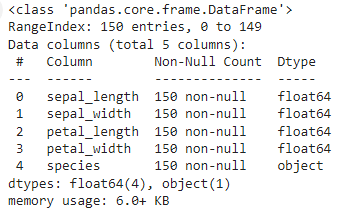

# CODSOFT
Data Science Internship
# Project 3: IRIS Flower Classification
# Objectives:
1- The Iris flower dataset consists of three species: setosa, versicolor, and virginica. These species can be distinguished based on their measurements. Now, imagine that you have the measurements of Iris flowers categorized by their respective species. Your objective is to train a machine learning model that can learn from these measurements and accurately classify the Iris flowers into their respective species.

2- Use the Iris dataset to develop a model that can classify iris flowers into different species based on their sepal and petal measurements. This dataset is widely used for introductory classification tasks.
# Data Preprocessing
## Import Libraries
```python
import numpy as np
import pandas as pd
import matplotlib.pyplot as plt
```
## Load the Dataset
```python
IRIS_dataset = pd.read_csv('/content/IRIS.csv')
```
## Get some info and description about the Dataset
```python
IRIS_dataset.head()
```


```python
IRIS_dataset.describe()
```

```python
IRIS_dataset.info()
```


## Check for null values
```python
IRIS_dataset.isnull().sum()
```

