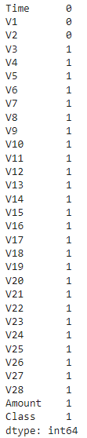
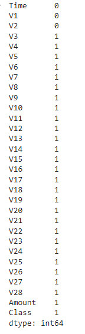
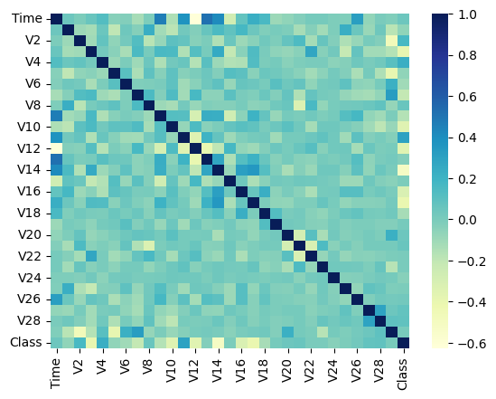
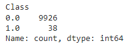
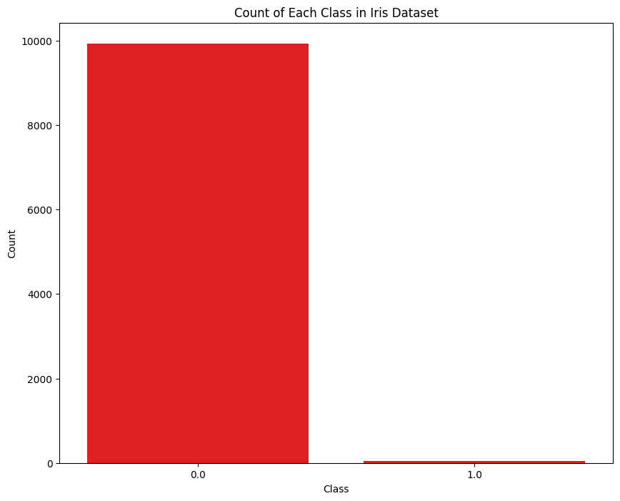
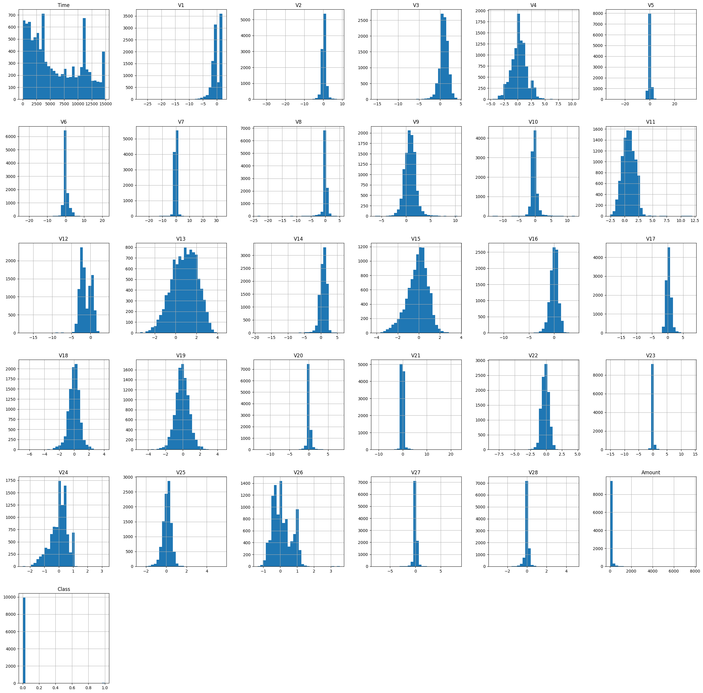
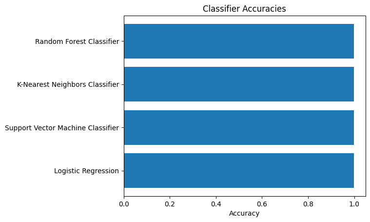
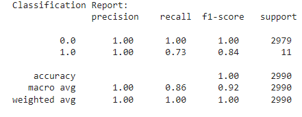

# CODSOFT
Data Science Internship
# Project 4: Credit Card Fraud Detection
# Objectives
1- Build a machine learning model to identify fraudulent credit card transactions.

2- Preprocess and normalize the transaction data, handle class imbalance issues, and split the dataset into training and testing sets.

3- Train a classification algorithm, such as logistic regression or random forests, to classify transactions as fraudulent or genuine.

4- Evaluate the model's performance using metrics like precision, recall, and F1-score, and consider techniques like oversampling or undersampling for improving results.

# Data Preprocessing 
## Import Libraries
```python
import numpy as np
import pandas as pd
import matplotlib.pyplot as plt
```
## Load Dataset
```python
Credit_dataset = pd.read_csv('/content/creditcard.csv', on_bad_lines='skip')
```
## Get some info and description about the dataset
```python
Credit_dataset.head()
Credit_dataset.describe()
Credit_dataset.info()
```
## Check for Null Values
```python
print(Credit_dataset.isnull().sum())
```


## Check for Missing Values
```python
Credit_dataset.isna().sum()
```


# Visualization
## Plotting a Heatmap
```python
numeric_columns = Credit_dataset.select_dtypes(include=["int64", "float64"])
import seaborn as sns
sns.heatmap(numeric_columns.corr(), cmap = "YlGnBu")
plt.show()
```

## Checking the 'Class' Count
```python
Credit_dataset['Class'].value_counts()
```


## Plotting a bar chart to Visualize the 'Class' Count
```python
Class_counts = Credit_dataset['Class'].value_counts()

#plot the bar chart
plt.figure(figsize=(10, 8))
sns.barplot(x=Class_counts.index, y=Class_counts.values, color='red')
plt.xlabel('Class')
plt.ylabel('Count')
plt.title('Count of Each Class in Iris Dataset')
plt.show()
```


## Plotting the distribution of Features
```python
Credit_dataset.hist(bins=30, figsize=(30, 30))
```

- From the Above figures and data we can deduce the following:
- - An imbalance occurs in the 'Class' column
  - We have to handle missing values
  - We have to normalize the features
## Filling the missing values with 0 in the Class column
```python
Credit_dataset['Class'] = Credit_dataset['Class'].fillna(0)
```
## Handling Missing Values
```python
from sklearn.impute import SimpleImputer
imputer = SimpleImputer(missing_values= np.nan, strategy = 'mean')
Credit_dataset = imputer.fit_transform(Credit_dataset)
```
## Creating the matrix of features and the dependent variable
```python
X = Credit_dataset.iloc[:, :-1].values
y = Credit_dataset.iloc[:, -1].values
print('Matrix of Features: ', X)
print('Dependent Variable: ', y)
```
## Feature Engineering
### Normalization
```python
from sklearn.preprocessing import MinMaxScaler
sc = MinMaxScaler()
X = sc.fit_transform(X)
X
```
- Since the Features is normally distrubted along 0 ==> Normalization
## Splitting the dataset into train and test
```python
from sklearn.model_selection import train_test_split
X_train, X_test, y_train, y_test = train_test_split(X, y, test_size = 0.3, random_state = 1, stratify = y)
print('X_train: ', X_train)
print('X_test: ', X_test)
print('y_train: ', y_train)
print('y_test: ', y_test)
```
## Oversampling
- Oversampling is increasing the number of instances in the minority class.
- Balance the class distribution by generating synthetic data.
Oversampling is done after splitting the dataset in order to:
- Prevent Information Leakage
- Improves Model Generalization

```python
from imblearn.over_sampling import RandomOverSampler
ros = RandomOverSampler()
# Perform oversampling on your training data
ros_X_train, ros_y_train = ros.fit_resample(X_train, y_train)
```
### Class distribution before and after Oversampling
```python
from collections import Counter
print('before sampling class distribution: ', Counter(y_train))
print('after sampling class distribution: ', Counter(ros_y_train))
```
before sampling class distribution:  Counter({0.0: 6948, 1.0: 27})

after sampling class distribution:  Counter({0.0: 6948, 1.0: 6948})

# Machine Learning
## Choose between the following models
### import libraries
```python
from sklearn.ensemble import RandomForestClassifier
from sklearn.neighbors import KNeighborsClassifier
from sklearn.svm import SVC
from sklearn.linear_model import LogisticRegression
from sklearn.metrics import accuracy_score
```
### Define classifiers
```python
classifiers = {
    "Random Forest Classifier" : RandomForestClassifier(n_estimators=100, random_state=42),
    "K-Nearest Neighbors Classifier" : KNeighborsClassifier(n_neighbors=5),
    "Support Vector Machine Classifier" : SVC(kernel='rbf', random_state = 42),
    "Logistic Regression": LogisticRegression(random_state=42)
}

accuracies = []
```
### Loop through classifiers: Get the best model with the best accuracy
```python
for name, classifier in classifiers.items():
  classifier.fit(ros_X_train, ros_y_train)
  y_pred = classifier.predict(X_test)
  accuracy = accuracy_score(y_test, y_pred)
  accuracies.append(accuracy)
  print(f"{name} Accuracy: {accuracy}")
```
- Random Forest Classifier Accuracy: 0.9989966555183947
- K-Nearest Neighbors Classifier Accuracy: 0.9986622073578595
- Support Vector Machine Classifier Accuracy: 0.9986622073578595
- Logistic Regression Accuracy: 0.9979933110367893

### Plotting the Accuracies
```python
fig, ax = plt.subplots()
models = classifiers.keys()
y_pos = np.arange(len(models))
ax.barh(y_pos, accuracies, align = 'center')
ax.set_yticks(y_pos)
ax.set_yticklabels(models)
ax.invert_yaxis()
ax.set_xlabel('Accuracy')
ax.set_title('Classifier Accuracies')
plt.show()
```


### Find the best model
```python
best_accuracy = max(accuracies)
best_model = list(classifiers.keys())[accuracies.index(best_accuracy)]
print(f"\nBest Model: {best_model} with Accuracy: {best_accuracy}")
```
- Best Model: Random Forest Classifier with Accuracy: 0.9989966555183947

### Train the Model on the dataset
```python
from sklearn.ensemble import RandomForestClassifier
classifier = RandomForestClassifier(n_estimators = 100, random_state = 42)
classifier.fit(ros_X_train, ros_y_train)
```
### Predict on the test set
y_pred = classifier.predict(X_test)

### Evaluate the Model
```python
from sklearn.metrics import accuracy_score, confusion_matrix, precision_score, recall_score, f1_score, classification_report
#computer accuracy
accuracy = accuracy_score(y_test, y_pred)
print("Accuracy: ", accuracy)

#computer confusion matrix
cm = confusion_matrix(y_test, y_pred)
print("Confusion Matrix: ", cm)

#computer precision
precision = precision_score(y_test, y_pred, average = 'weighted')
print("precision: ", precision)


#computer recall
recall = recall_score(y_test, y_pred, average = 'weighted')
print("recall: ", recall)

#computer F1 Score
f1 = f1_score(y_test, y_pred, average = 'weighted')
print("F1 Score: ", f1)

# generate Classfication Report
class_report = classification_report(y_test, y_pred)
print("Classification Report:\n", class_report)
```
- Accuracy:  0.9989966555183947
- Confusion Matrix:  [[2979    0]
 [   3    8]]
- precision:  0.9989976649192817
- recall:  0.9989966555183947
- F1 Score:  0.9989176965891743




# Making a prediction
```python
# predict to see if the transaction is valid or fraud
input_data = np.array([406.0, -2.3122265423263, 1.95199201064158, -1.60985073229769, 3.9979055875468, -0.522187864667764, -1.42654531920595, -2.53738730624579, 1.39165724829804, -2.77008927719433, -2.77227214465915, 3.20203320709635, -2.89990738849473, -0.595221881324605, -4.28925378244217, 0.389724120274487, -1.14074717980657, -2.83005567450437, -0.0168224681808257, 0.416955705037907, 0.126910559061474, 0.517232370861764, -0.0350493686052974, -0.465211076182388, 0.320198198514526, 0.0445191674731724, 0.177839798284401, 0.261145002567677, -0.143275874698919, 0.0]).reshape(-1, 30)

# Normalize the input data
input_data_normalized = sc.transform(input_data)

# Predict the value
predicted_value = classifier.predict(input_data_normalized)

print(predicted_value)
```
## Result
[1.]

# Cross-Validation
```python
from sklearn.model_selection import cross_val_score, KFold
from sklearn.ensemble import RandomForestClassifier

# Define your Random Forest classifier
model = RandomForestClassifier(n_estimators=100, random_state=1)

# Define the number of folds for cross-validation
num_folds = 5

# Define the cross-validation method 
kf = KFold(n_splits=num_folds, shuffle=True, random_state=1)

# Perform cross-validation
cv_scores = cross_val_score(model, X, y, cv=kf, scoring='accuracy')

# Print the cross-validation scores
print("Cross-Validation Scores:", cv_scores)

# Print the mean and standard deviation of the cross-validation scores
print("Mean CV Accuracy:", cv_scores.mean())
print("Std CV Accuracy:", cv_scores.std())
```
## Result
Cross-Validation Scores: [0.99949824 1.         0.99949824 0.99949824 0.99899649]

Mean CV Accuracy: 0.9994982438534873

Std CV Accuracy: 0.00031733845059393366

Overall, the high accuracy, consistent performance metrics, and cross-validation results suggest that the model is not overfitting to the training data.


