# CODSOFT
Data Science Internship
# Project 5: Movie Rating Prediction with Python
# Objectives
1- Build a model that predicts the rating of a movie based on features like genre, director, and actors. You can use regression techniques to tackle this problem.

2- The goal is to analyze historical movie data and develop a model that accurately estimates the rating given to a movie by users or critics.

3- Movie Rating Prediction project enables you to explore data analysis, preprocessing, feature engineering, and machine learning modeling techniques. It provides insights into the factors that influence movie ratings and allows you to build a model that can estimate the ratings of movies accurately.

# Data Preprocessing
## Import Libraries
```python
import numpy as np
import pandas as pd
import matplotlib.pyplot as plt
```
## Import Dataset
```python
Movies_dataset = pd.read_csv('/content/IMDb Movies India.csv', encoding = 'latin1')
```
## Get Some Info and Description about the Dataset
```python
Movies_dataset.head()
```
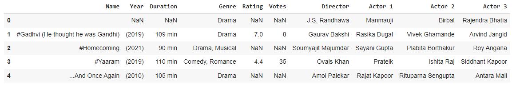

```python
Movies_dataset.info()
```
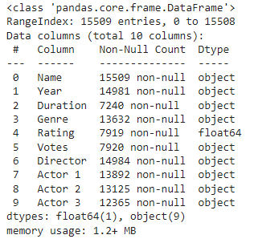

```python
Movies_dataset.describe()
```
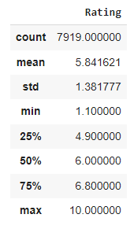

## Check for Null Values
```python
Movies_dataset.isnull().sum()
```
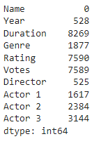
## Check for Missing Values
```python
Movies_dataset.isna().sum()
```
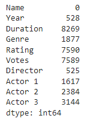

## Check for Duplicates
```python
Movies_dataset.duplicated().sum()
```
6
## Remove Duplicates
```python
Movies_dataset.drop_duplicates(inplace = True)
```
## Drop Missing Values
```python
Movies_dataset.dropna(inplace = True)
```
## Convert 'Year' and 'Votes' into Integers
```python
Movies_dataset['Year'] = Movies_dataset['Year'].str.strip('()').astype(int)
Movies_dataset['Votes'] = Movies_dataset['Votes'].str.replace(',','').astype('int')
```
## Remove 'min' suffix from Duration
```python
Movies_dataset['Duration'] = Movies_dataset['Duration'].str.strip('min')
```
## Drop the 'Name' Column from the dataset
```python
Movies_dataset.drop('Name',axis=1,inplace=True)
```
# Visualization
## Plot the distribution of Rating
```python
plt.figure(figsize = (10, 6))
plt.hist(Movies_dataset['Rating'], bins = 10)
plt.xlabel('Rating')
plt.ylabel('Count')
plt.title('Distribution of Ratings')
plt.show()
```
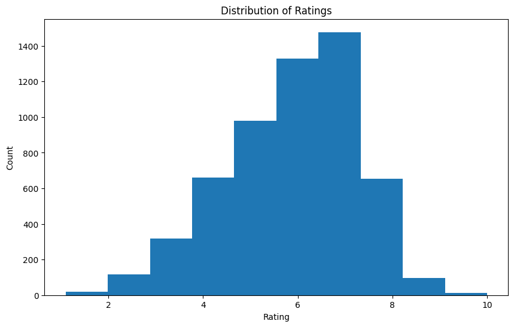

## Plot the distribution of year
```python
plt.figure(figsize = (10, 6))
plt.hist(Movies_dataset['Year'], bins = 10)
plt.xlabel('Year')
plt.ylabel('Count')
plt.title('Distribution of Year')
plt.show()
```
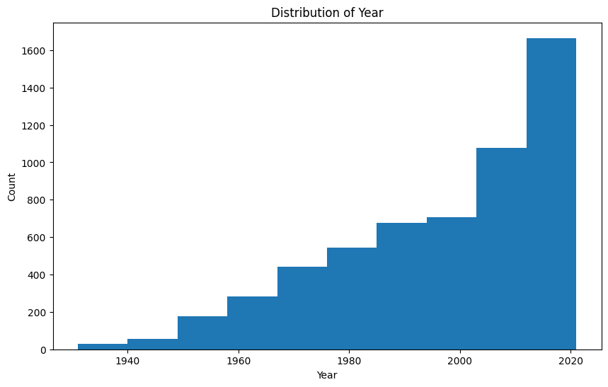

## Plot the realtion between Year and Rating
```python
plt.figure(figsize = (10, 6))
plt.scatter(Movies_dataset['Year'], Movies_dataset['Rating'])
plt.xlabel('Year')
plt.ylabel('Rating')
plt.title('Relation between Year and Rating')
plt.show()
```
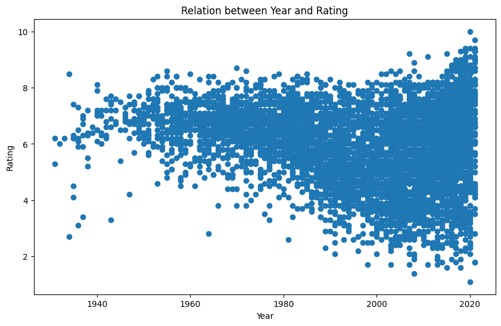

## Plot the Genre Frequency in the data
```python
# Split genres into individual values
genres = Movies_dataset['Genre'].str.split(', ').explode()

# Count the frequency of each genre
genre_counts = genres.value_counts()

# Plot
plt.figure(figsize=(12, 6))
genre_counts.plot(kind='bar', color='skyblue')
plt.title('Genre Frequency in the Dataset')
plt.xlabel('Genre')
plt.ylabel('Frequency')
plt.xticks(rotation=45, ha='right')
plt.tight_layout()
plt.show()
```
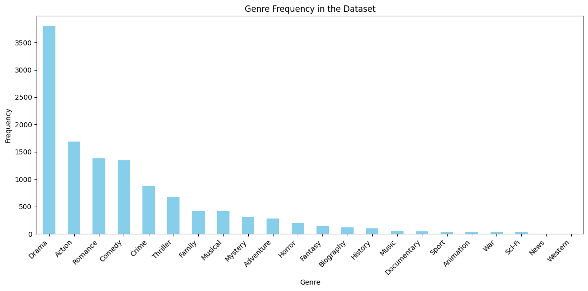

## Plot the relation between Votes and Rating
```python
plt.figure(figsize = (10, 6))
plt.scatter(Movies_dataset['Votes'], Movies_dataset['Rating'])
plt.xlabel('Votes')
plt.ylabel('Rating')
plt.title('Relation between Votes and Rating')
plt.show()
```
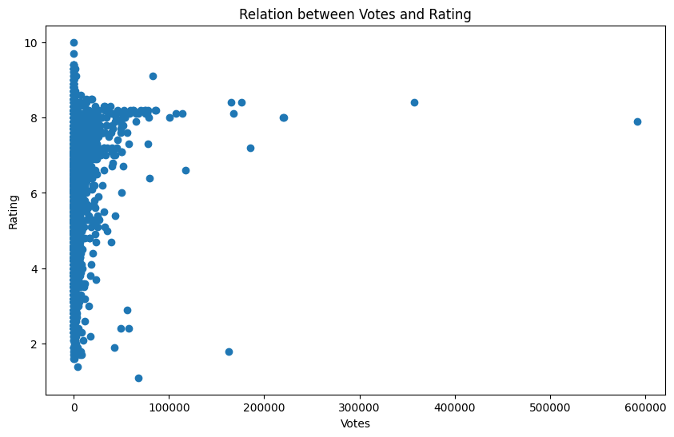

# Data Processing and Cleaning
## Label Encoding Categorical Features
```python
from sklearn.preprocessing import LabelEncoder
le = LabelEncoder()
Movies_dataset['Genre'] = le.fit_transform(Movies_dataset['Genre'])
Movies_dataset['Actor 1'] = le.fit_transform(Movies_dataset['Actor 1'])
Movies_dataset['Actor 2'] = le.fit_transform(Movies_dataset['Actor 2'])
Movies_dataset['Actor 3'] = le.fit_transform(Movies_dataset['Actor 3'])
Movies_dataset['Director'] = le.fit_transform(Movies_dataset['Director'])
```
## Creating the matrix of features and the dependent variable
```python
X = Movies_dataset.drop('Rating', axis = 1)
y = Movies_dataset['Rating']
print('Matrix of Features: ', X)
print('Dependent Variable: ', y)
```
## Splitting the dataset into train and test
```python
from sklearn.model_selection import train_test_split
X_train, X_test, y_train, y_test = train_test_split(X, y, test_size = 0.3, random_state = 42)
print('X_train: ', X_train)
print('X_test: ', X_test)
print('y_train: ', y_train)
print('y_test: ', y_test)
```
## Feature Engineering
### Standardization
```python
from sklearn.preprocessing import StandardScaler
sc = StandardScaler()
X_train = sc.fit_transform(X_train)
X_test = sc.transform(X_test)
```
# Machine Learning
## Choosing between: Linear Regression, Polynomial Regression, Support Vector Regression, Decision Tree Regression and Random Forest Regression
### Import Libraries
```python
from sklearn.linear_model import LinearRegression
from sklearn.preprocessing import PolynomialFeatures
from sklearn.svm import SVR
from sklearn.tree import DecisionTreeRegressor
from sklearn.ensemble import RandomForestRegressor
from sklearn.metrics import mean_squared_error
```
### Define the Models
```python
models = {
    'Linear Regression': LinearRegression(),
    'Polynomial Regression': PolynomialFeatures(degree=2),
    'SVR': SVR(kernel='linear'),
    'Decision Tree Regression': DecisionTreeRegressor(random_state=42),
    'Random Forest Regression': RandomForestRegressor(n_estimators=100, random_state=42)
}
```
### Training and Evaluation
```python
results = {}
for name, model in models.items():
    if name == 'Polynomial Regression':
        poly_features = PolynomialFeatures(degree=2)  
        X_poly_train = poly_features.fit_transform(X_train)
        X_poly_test = poly_features.transform(X_test)
        model = LinearRegression()
        model.fit(X_poly_train, y_train)
        predictions = model.predict(X_poly_test)
    else:
        model.fit(X_train, y_train)
        predictions = model.predict(X_test)
    
    rmse = np.sqrt(mean_squared_error(y_test, predictions))
    results[name] = rmse
```
### Finding the Best Model
```python
best_model = min(results, key=results.get)
best_rmse = results[best_model]
```
### Print results
```python
print("Results:")
for name, rmse in results.items():
    print(f"{name} RMSE: {rmse}")

print(f"\nBest Model: {best_model} (RMSE: {best_rmse})")
```
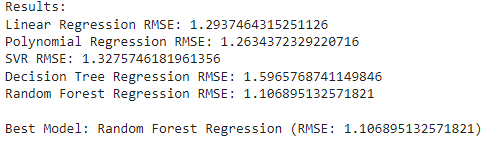

# Tuning the Model's Hyperparameters
```python
from sklearn.model_selection import GridSearchCV

# Define the parameter grid
param_grid = {
    'n_estimators': [50, 100, 150],
    'max_depth': [None, 10, 20],
    'min_samples_split': [2, 5, 10],
    'min_samples_leaf': [1, 2, 4]
}
```
# Initialize the Random Forest Regression model
```python
rf_model_tuned = RandomForestRegressor(random_state=42)
```
# Perform Grid Search
```python
grid_search = GridSearchCV(estimator=rf_model_tuned, param_grid=param_grid, 
                           cv=5, scoring='neg_mean_squared_error', n_jobs=-1)
grid_search.fit(X_train, y_train)
```
# Get the best parameters
```python
best_params = grid_search.best_params_
print("Best Parameters:", best_params)
```
Best Parameters: {'max_depth': None, 'min_samples_leaf': 4, 'min_samples_split': 10, 'n_estimators': 150}
# Train the model with the best parameters
```python
best_rf_model = RandomForestRegressor(random_state=42, **best_params)
best_rf_model.fit(X_train, y_train)
```
# Make predictions
```python
best_rf_predictions = best_rf_model.predict(X_test)
```
# Calculate RMSE
```python
best_rf_rmse = np.sqrt(mean_squared_error(y_test, best_rf_predictions))
best_rf_rmse
```
1.103345908616346
# Make a Prediction
```python
# Reshape the input data into a 2D array
input_data = np.array([2019, 109, 229, 8, 629, 1352, 2272, 319]).reshape(1, -1)

input_data_scaled = sc.transform(input_data)

# Make predictions using the reshaped data
predicted_value = best_rf_model.predict(input_data_scaled)

# Print the predicted value
print(predicted_value)
```
[6.87314244]


